# Graduate Projects

Some of the class projects that I’ve done before 2016 are listed on this page. For current research, please visit my [PhD Research Page](https://www.kvaziri.com/phd-research/).

### Experimental Game Technologies

This 8000 level course was a complete joy with Prof. Stephen Guy. With its detailed explanations of game techniques like One-Button Games, Crowd Simulations, advanced AI techniques, and visual and sound effects, it quickly became my favorite class of all times.

* For the One-Button Game project, I designed and coded a small boat game called Sea Rescue One-Button Game.
* For the second game with “no-touching” criteria, I re-engineered my Head-Pose Estimation (HPE) code into a bubble bursting game.
* For my final project, I used Raspberry Pi 3.0 to create an Augmented Reality (AR) Tic-Tac-Toe game with the help of [ArUCo marker detection library](https://github.com/vaziri/ArUco-Tic-Tac-Toe).

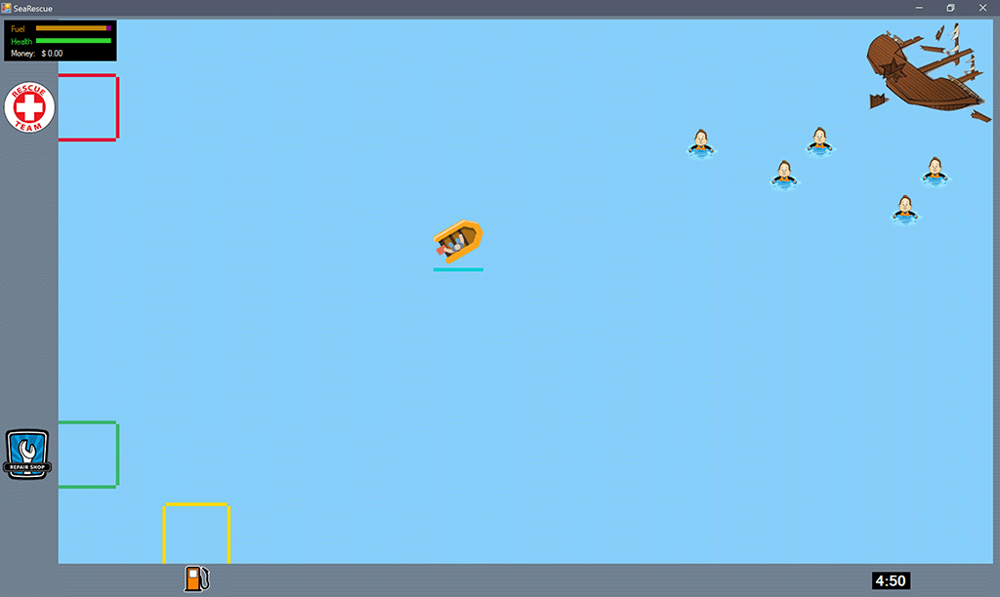 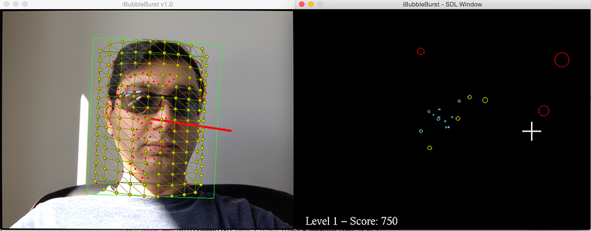 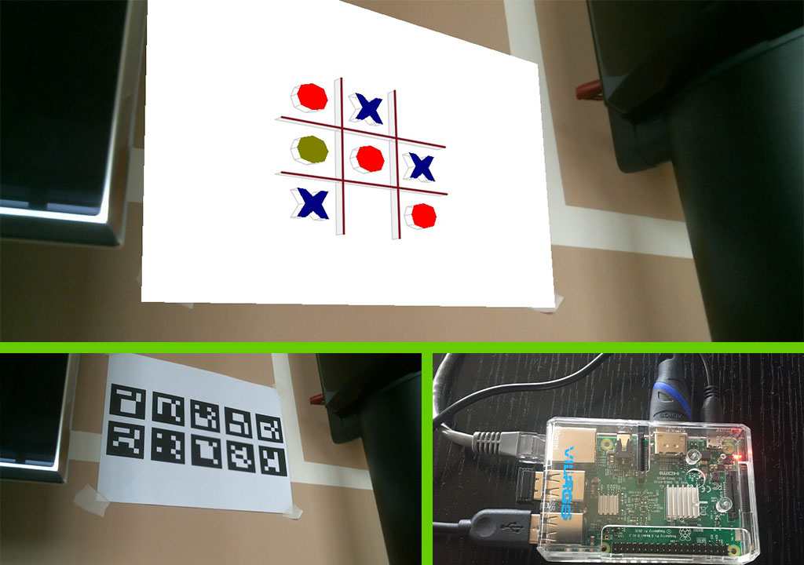 

### Virtual Reality

Virtual Reality is an ongoing research for me, but for this time period, I got to experiment with different edge-detection and Non-Photo Realistic (NPR) techniques both on CPU and GPU.

  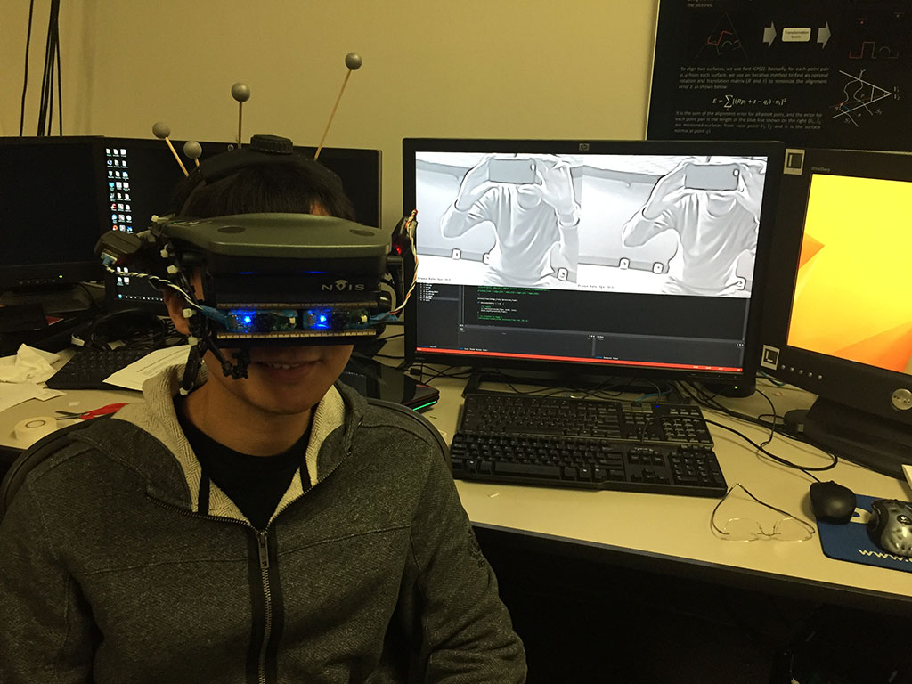 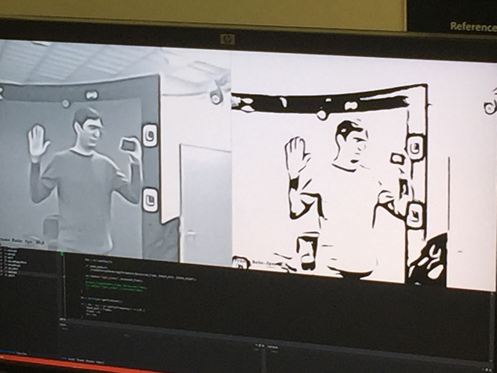

### Computer Vision

Computer Vision course with Prof. Volkan Isler included projects on edge-detections, homography, optical flow, and 3D rectification of stereo pairs. My final project was Head-Pose Estimation (HPE) with a single calibrated webcam.

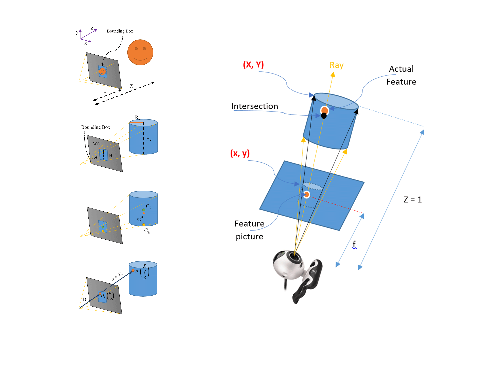 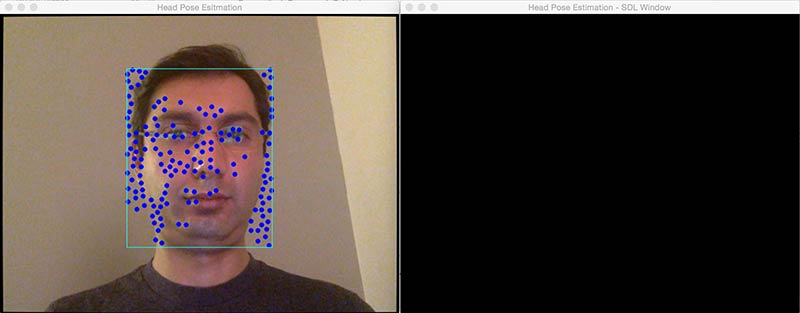 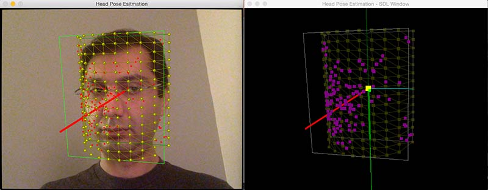 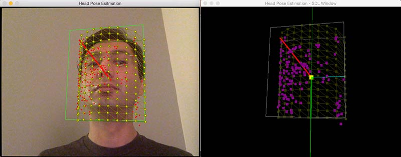 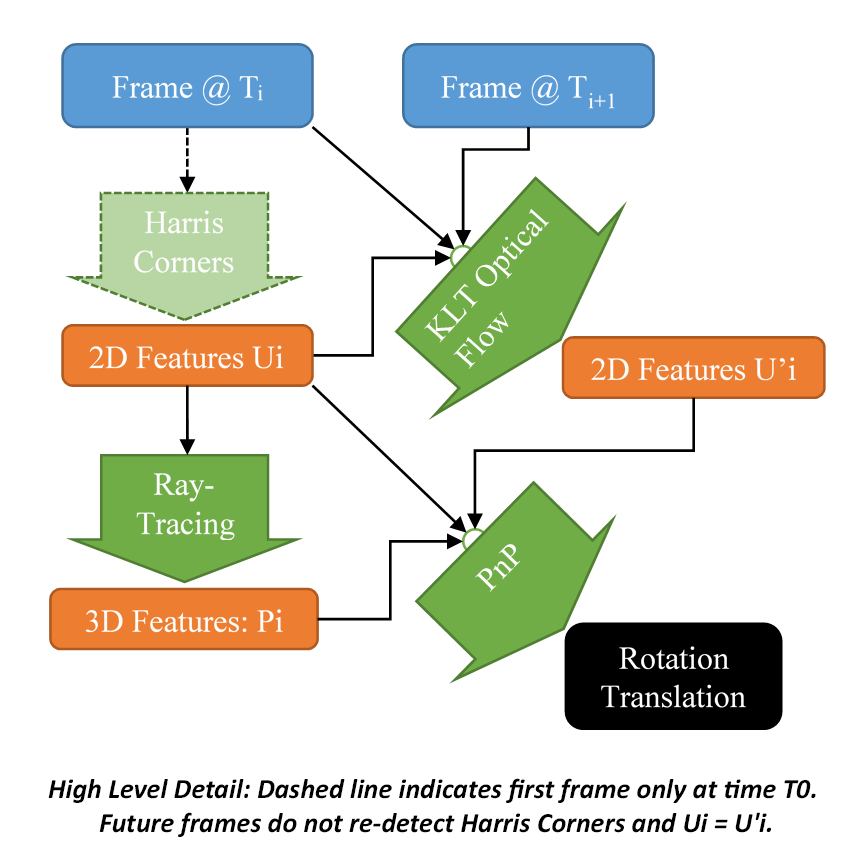

### Visualization

Data Visualization class with Prof. Dan Keefe included learning visualization and data filtering techniques like linking and brushing. For the final project, I visualized the microbiome population in mice’s guts treated with antibiotics in D3JS.

 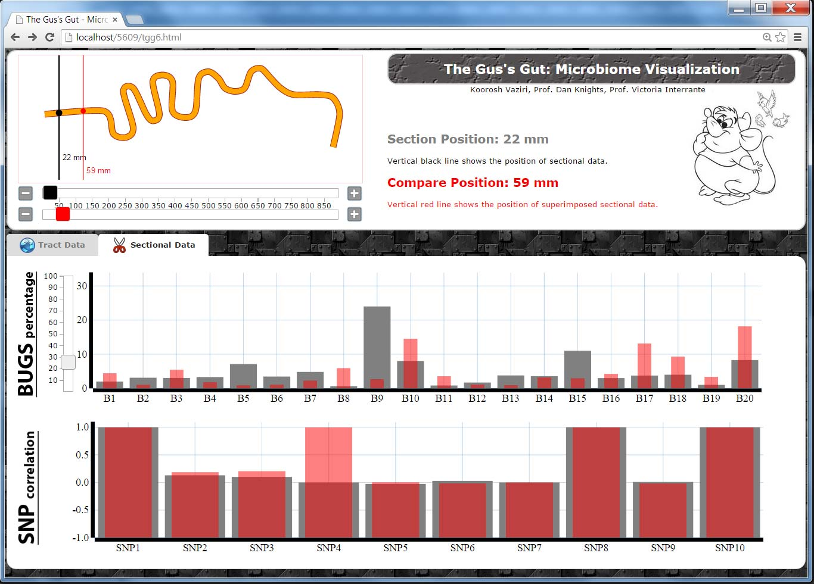 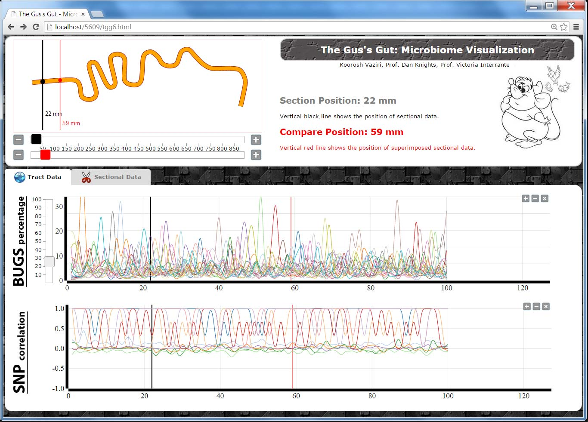 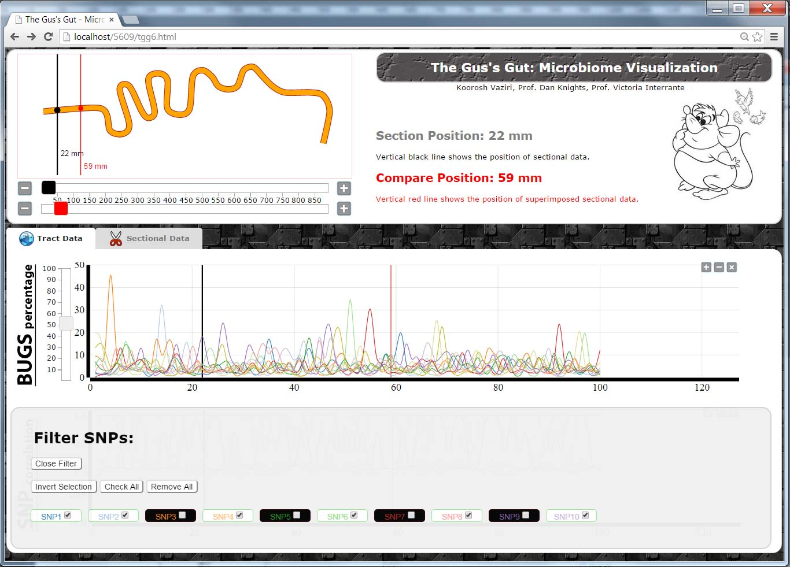 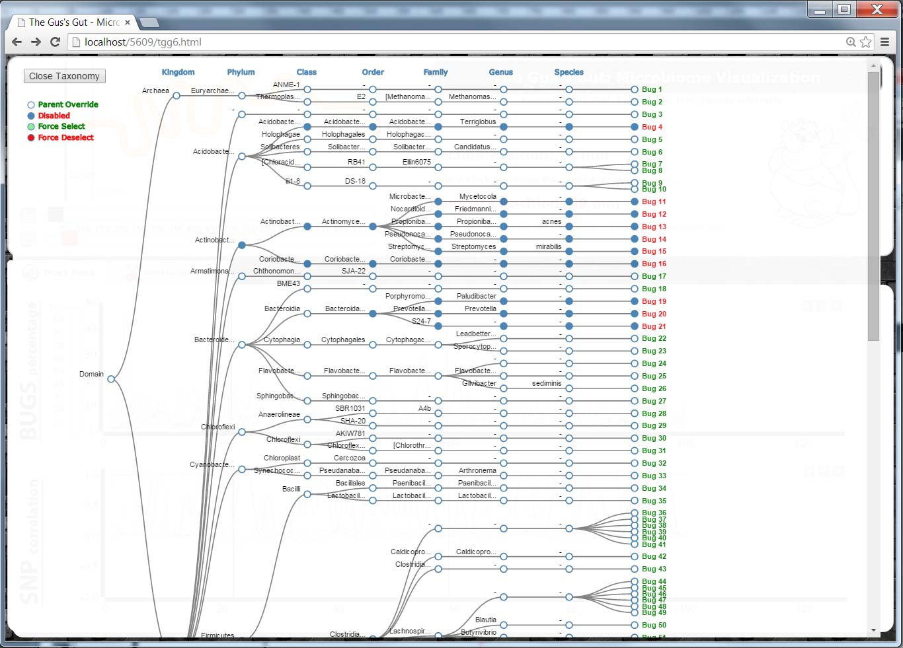 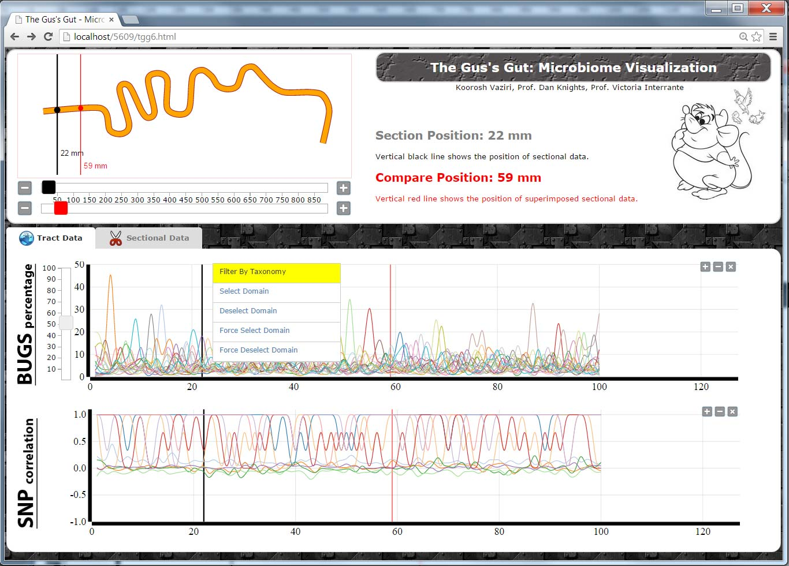 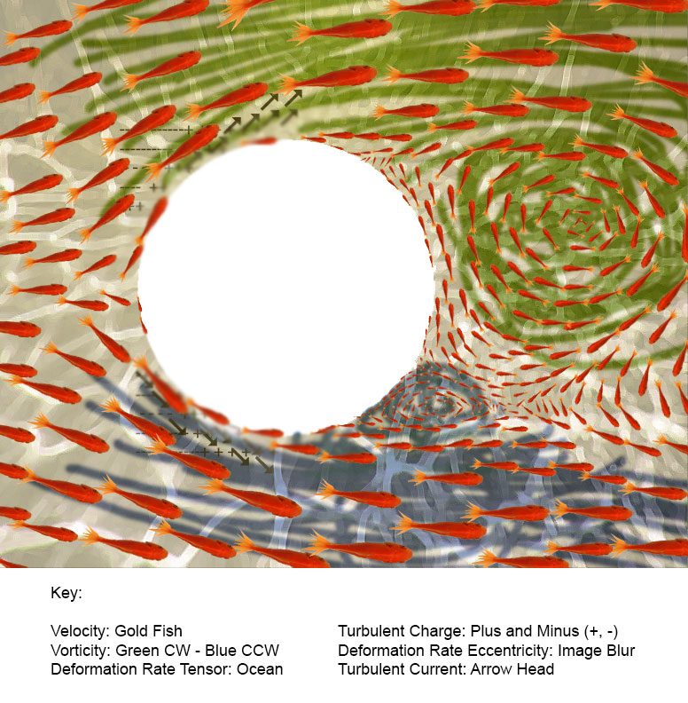
